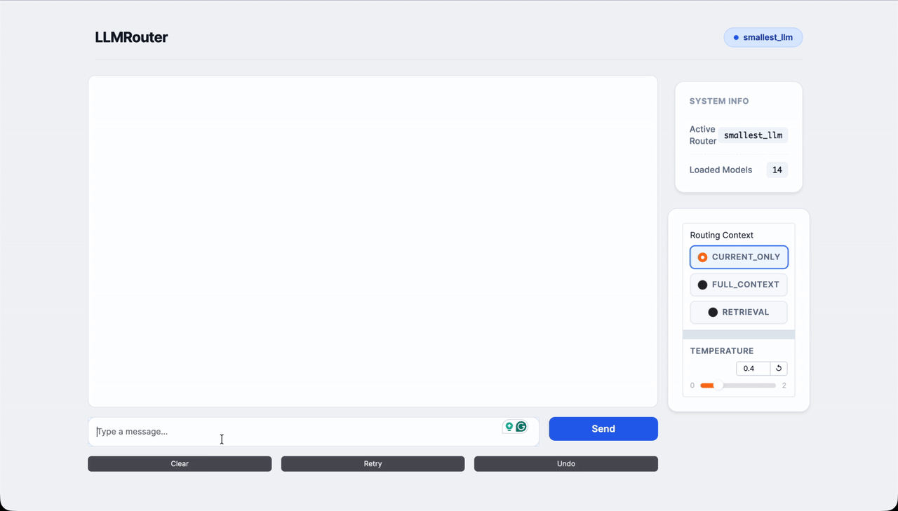

<div style="text-align:center;">
    
</div>


<h1 align="center">LLMRouter: An Open-Source Library for LLM Routing</h1>

<div align="center">

[](https://www.python.org/downloads/release/python-3109/)
[](https://github.com/ulab-uiuc/LLMRouter/pulls)
[](https://join.slack.com/t/llmrouteropen-ri04588/shared_invite/zt-3jz3cc6d1-ncwKEHvvWe0OczHx7K5c0g)
[](LICENSE)

</div>

## Introduction ✨

**LLMRouter** is an intelligent routing system designed to optimize LLM inference by dynamically selecting the most suitable model for each query. To achieve intelligent routing, it defines:

1. 🚀 *Smart Routing*: Automatically routes queries to the optimal LLM based on task complexity, cost, and performance requirements.
2. 📊 *Multiple Router Models*: Support for **over 16 routing models**, including KNN, SVM, MLP, Matrix Factorization, Elo Rating, Graph-based routers, BERT-based routers, Hybrid probabilistic routers, transformed-score routers, multi-round routers, and many additional advanced strategies.
3. 🛠️ *Unified CLI*: Complete command-line interface for training, inference, and interactive chat with Gradio-based UI.
4. 📈 *Data Generation Pipeline*: Complete pipeline for generating training data from 11 benchmark datasets with automatic API calling and evaluation.

## News 📰

- 🚀 **[2025-12]**: **LLMRouter** is officially released - ship smarter 🧠, cost-aware 💸 LLM routing with 16+ routers 🧭, a unified `llmrouter` CLI 🛠️, and a plugin workflow for custom routers 🧩.


## Supported Routers 🧭

### Single-Round Routers
| Router | Training | Inference | Description | Tutorial |
|--------|:--------:|:---------:|-------------|:--------:|
| `knnrouter` | ✅ | ✅ | K-Nearest Neighbors based routing | [📖](llmrouter/models/knnrouter/README.md) |
| `svmrouter` | ✅ | ✅ | Support Vector Machine based routing | [📖](llmrouter/models/svmrouter/README.md) |
| `mlprouter` | ✅ | ✅ | Multi-Layer Perceptron based routing | [📖](llmrouter/models/mlprouter/README.md) |
| `mfrouter` | ✅ | ✅ | Matrix Factorization based routing | [📖](llmrouter/models/mfrouter/README.md) |
| `elorouter` | N/A | ✅ | Elo Rating based routing | [📖](llmrouter/models/elorouter/README.md) |
| `routerdc` | ✅ | ✅ | Dual Contrastive learning based routing | [📖](llmrouter/models/routerdc/README.md) |
| `automix` | N/A | ✅ | Automatic model mixing | [📖](llmrouter/models/automix/README.md) |
| `hybrid_llm` | ✅ | ✅ | Hybrid LLM routing strategy | [📖](llmrouter/models/hybrid_llm/README.md) |
| `graphrouter` | ✅ | ✅ | Graph-based routing | [📖](llmrouter/models/graphrouter/README.md) |
| `causallm_router` | ✅ | ✅ | Causal Language Model router | [📖](llmrouter/models/causallm_router/README.md) |
| `smallest_llm` | N/A | ✅ | Always routes to smallest model | [📖](llmrouter/models/smallest_llm/README.md) |
| `largest_llm` | N/A | ✅ | Always routes to largest model | [📖](llmrouter/models/largest_llm/README.md) |

### Multi-Round Routers
| Router | Training | Inference | Description | Tutorial |
|--------|:--------:|:---------:|-------------|:--------:|
| `router_r1` | [LINK](https://github.com/ulab-uiuc/Router-R1) | ✅ | Pre-trained Router-R1 model for multi-turn conversations | [📖](llmrouter/models/router_r1/README.md) |

### Personalized Routers
| Router | Training | Inference | Description | Tutorial |
|--------|:--------:|:---------:|-------------|:--------:|
| `gmtrouter` | ✅ | ✅ | Graph-based personalized router with user preference learning | [📖](llmrouter/models/gmtrouter/README.md) |

### Agentic Routers
| Router | Training | Inference | Description | Tutorial |
|--------|:--------:|:---------:|-------------|:--------:|
| `knnmultiroundrouter` | ✅ | ✅ | KNN-based agentic router for complex tasks | [📖](llmrouter/models/knnmultiroundrouter/README.md) |
| `llmmultiroundrouter` | N/A | ✅ | LLM-based agentic router for complex tasks | [📖](llmrouter/models/llmmultiroundrouter/README.md) |

## Get Started 🚀

### Installation

#### Install from source

Clone the repository and install in editable mode using a virtual environment (e.g., with anaconda3):

```bash
# Clone the repository
git clone https://github.com/ulab-uiuc/LLMRouter.git
cd LLMRouter

# Create and activate virtual environment
conda create -n llmrouter python=3.10
conda activate llmrouter

# Install the package
pip install -e .
```

#### Install from PyPI

```bash
pip install llmrouter
```

### Setting Up API Keys 🔑

LLMRouter requires API keys to make LLM API calls for inference, chat, and data generation. Set the `API_KEYS` environment variable using one of the following formats:

**JSON Array Format** (recommended for multiple keys):
```bash
export API_KEYS='["your-key-1", "your-key-2", "your-key-3"]'
```

**Comma-Separated Format** (alternative for multiple keys):
```bash
export API_KEYS='key1,key2,key3'
```

**Single Key** (for one API key):
```bash
export API_KEYS='your-api-key'
```

**Note**: 
- API keys are used for **inference**, **chat interface**, and **data generation** (Step 3 of the pipeline)
- Multiple keys enable automatic load balancing across API calls
- The environment variable must be set before running inference, chat, or data generation commands
- For persistent setup, add the export command to your shell profile (e.g., `~/.bashrc` or `~/.zshrc`)

### Preparing Training Data 📊

LLMRouter includes a complete data generation pipeline that transforms raw benchmark datasets into formatted routing data with embeddings. The pipeline supports 11 diverse benchmark datasets including Natural QA, Trivia QA, MMLU, GPQA, MBPP, HumanEval, GSM8K, CommonsenseQA, MATH, OpenbookQA, and ARC-Challenge.

#### Pipeline Overview

The data generation pipeline consists of three main steps:

1. **Generate Query Data** - Extract queries from benchmark datasets and create train/test split JSONL files
2. **Generate LLM Embeddings** - Create embeddings for LLM candidates from their metadata
3. **API Calling & Evaluation** - Call LLM APIs, evaluate responses, and generate unified embeddings + routing data

#### Quick Start

Start with the sample configuration file:

```bash
# Step 1: Generate query data
python llmrouter/data/data_generation.py --config llmrouter/data/sample_config.yaml

# Step 2: Generate LLM embeddings
python llmrouter/data/generate_llm_embeddings.py --config llmrouter/data/sample_config.yaml

# Step 3: API calling & evaluation (requires API_KEYS - see "Setting Up API Keys" section above)
python llmrouter/data/api_calling_evaluation.py --config llmrouter/data/sample_config.yaml --workers 100
```

#### Output Files

The pipeline generates the following files:

- **Query Data** (JSONL): `query_data_train.jsonl` and `query_data_test.jsonl` - Query data with train/test split
- **LLM Embeddings** (JSON): `default_llm_embeddings.json` - LLM metadata with embeddings
- **Query Embeddings** (PyTorch): `query_embeddings_longformer.pt` - Unified embeddings for all queries
- **Routing Data** (JSONL): `default_routing_train_data.jsonl` and `default_routing_test_data.jsonl` - Complete routing data with model responses, performance scores, and token usage

**Example routing data entry:**
```json
{
  "task_name": "gsm8k",
  "query": "Janet has 4 apples. She gives 2 to Bob. How many does she have left?",
  "ground_truth": "2",
  "metric": "GSM8K",
  "model_name": "llama3-chatqa-1.5-8b",
  "response": "Janet has 4 apples and gives 2 to Bob, so she has 4 - 2 = 2 apples left.",
  "performance": 1.0,
  "embedding_id": 42,
  "token_num": 453
}
```

#### Configuration

All paths and parameters are controlled via YAML configuration. The sample config file (`llmrouter/data/sample_config.yaml`) references the example data directory and can be used as-is or customized for your setup.

**Note**: Step 3 requires API keys for calling LLM services. See the [Setting Up API Keys](#setting-up-api-keys-) section above for configuration details.

For complete documentation including detailed file formats, embedding mapping system, configuration options, and troubleshooting, see **[llmrouter/data/README.md](llmrouter/data/README.md)**.

### Training a Router

Before training, ensure you have prepared your data using the [Data Generation Pipeline](#preparing-training-data-) or use the example data in `data/example_data/`.

Train various router models with your configuration:
```bash
# Train KNN router
llmrouter train --router knnrouter --config configs/model_config_train/knnrouter.yaml

# Train MLP router with GPU
llmrouter train --router mlprouter --config configs/model_config_train/mlprouter.yaml --device cuda

# Train MF router quietly
llmrouter train --router mfrouter --config configs/model_config_train/mfrouter.yaml --quiet
```

### Running Inference

Perform inference with trained routers (requires API keys - see [Setting Up API Keys](#setting-up-api-keys-) section):
```bash
# Single query inference
llmrouter infer --router knnrouter --config config.yaml --query "What is machine learning?"

# Batch inference from file
llmrouter infer --router knnrouter --config config.yaml --input queries.txt --output results.json

# Route only (without calling LLM API - no API keys needed)
llmrouter infer --router knnrouter --config config.yaml --query "Hello" --route-only

# Custom generation parameters
llmrouter infer --router knnrouter --config config.yaml --query "Explain AI" --temp 0.7 --max-tokens 2048 --verbose
```

Input file formats supported: `.txt` (one query per line), `.json` (list of strings or objects with `"query"` field), `.jsonl` (one JSON object per line).

### Interactive Chat Interface

Launch a Gradio-based chat interface (requires API keys - see [Setting Up API Keys](#setting-up-api-keys-) section):

<div style="text-align:center;">
    
</div>

<p align="center">
    <strong>📱 Quick Preview:</strong> Animated overview of the LLMRouter chat interface showing real-time routing and model selection.
</p>

<div style="text-align:center;">
    <video width="100%" controls style="max-width: 800px; height: auto;">
        <source src="assets/llmrouter_chat_demo.mov" type="video/quicktime">
        Your browser does not support the video tag.
    </video>
</div>

<p align="center">
    <strong>🎥 Full Demo:</strong> Complete walkthrough demonstrating the interactive chat interface, including query routing, model selection, and response generation.
</p>
```bash
# Basic chat interface
llmrouter chat --router knnrouter --config config.yaml

# Custom host and port
llmrouter chat --router knnrouter --config config.yaml --host 0.0.0.0 --port 7860

# With public sharing link
llmrouter chat --router knnrouter --config config.yaml --share

# Specify query mode
llmrouter chat --router knnrouter --config config.yaml --mode full_context --top_k 5
```

Query Modes:
- `current_only`: Routes based on current query only (default)
- `full_context`: Combines all chat history with current query
- `retrieval`: Retrieves top-k similar historical queries for context

### Direct Script Execution

You can also run the CLI scripts directly:
```bash
# Training
python -m llmrouter.cli.router_train --router knnrouter --config config.yaml

# Inference
python -m llmrouter.cli.router_inference --router knnrouter --config config.yaml --query "Hello"

# Chat
python -m llmrouter.cli.router_chat --router knnrouter --config config.yaml
```

## 🔧 Creating Custom Routers

LLMRouter supports a **plugin system** that allows you to add custom router implementations without modifying the core codebase. This makes it easy to experiment with new routing strategies or domain-specific routers.

### Quick Start

**1. Create your router directory:**
```bash
mkdir -p custom_routers/my_router
```

**2. Implement your router** (`custom_routers/my_router/router.py`):
```python
from llmrouter.models.meta_router import MetaRouter
import torch.nn as nn

class MyRouter(MetaRouter):
    """Your custom router implementation."""

    def __init__(self, yaml_path: str):
        # Initialize with a model (can be nn.Identity() for simple routers)
        model = nn.Identity()
        super().__init__(model=model, yaml_path=yaml_path)

        # Get available LLM names from config
        self.llm_names = list(self.llm_data.keys())

    def route_single(self, query_input: dict) -> dict:
        """Route a single query to the best LLM."""
        query = query_input['query']

        # Your custom routing logic here
        # Example: route based on query length
        selected_llm = (self.llm_names[0] if len(query) < 50
                       else self.llm_names[-1])

        return {
            "query": query,
            "model_name": selected_llm,
            "predicted_llm": selected_llm,
        }

    def route_batch(self, batch: list) -> list:
        """Route multiple queries."""
        return [self.route_single(q) for q in batch]
```

**3. Create configuration** (`custom_routers/my_router/config.yaml`):
```yaml
data_path:
  llm_data: 'data/example_data/llm_candidates/default_llm.json'

hparam:
  # Your hyperparameters here

api_endpoint: 'https://integrate.api.nvidia.com/v1'
```

**4. Use your custom router** (same as built-in routers!):
```bash
# Inference
llmrouter infer --router my_router \
  --config custom_routers/my_router/config.yaml \
  --query "What is machine learning?"

# List all routers (including custom ones)
llmrouter list-routers
```

### Plugin Discovery

Custom routers are automatically discovered from:
- `./custom_routers/` (recommended - project directory)
- `~/.llmrouter/plugins/` (user home directory)
- `$LLMROUTER_PLUGINS` environment variable (colon-separated paths)

### Example Routers

LLMRouter includes example custom routers you can learn from:

**RandomRouter** - Simple baseline that randomly selects an LLM
```bash
llmrouter infer --router randomrouter \
  --config custom_routers/randomrouter/config.yaml \
  --query "Hello world"
```

**ThresholdRouter** - Advanced trainable router with difficulty estimation
```bash
# Train the router
llmrouter train --router thresholdrouter \
  --config custom_routers/thresholdrouter/config.yaml

# Use for inference
llmrouter infer --router thresholdrouter \
  --config custom_routers/thresholdrouter/config.yaml \
  --query "Explain quantum computing"
```

### Documentation

For detailed guides on creating custom routers:
- 📖 **Quick Start**: [custom_routers/README.md](custom_routers/README.md)
- 📖 **Detailed Tutorial**: [docs/CUSTOM_ROUTERS.md](docs/CUSTOM_ROUTERS.md)
- 📖 **Implementation Summary**: [CUSTOM_ROUTER_SUMMARY.md](CUSTOM_ROUTER_SUMMARY.md)

### Common Routing Patterns

**Rule-based routing:**
```python
def route_single(self, query_input):
    query = query_input['query'].lower()
    if 'code' in query:
        return {"model_name": "code-specialist"}
    elif len(query) < 50:
        return {"model_name": "small-fast-model"}
    else:
        return {"model_name": "large-capable-model"}
```

**Embedding-based routing:**
```python
from llmrouter.utils import get_longformer_embedding

def route_single(self, query_input):
    embedding = get_longformer_embedding(query_input['query'])
    # Use embedding similarity to select best model
    selected = self._find_best_model(embedding)
    return {"model_name": selected}
```

**Cost-optimized routing:**
```python
def route_single(self, query_input):
    difficulty = self._estimate_difficulty(query_input)
    # Select cheapest model that can handle the difficulty
    for model_name, info in sorted(self.llm_data.items(),
                                   key=lambda x: x[1]['cost']):
        if info['capability'] >= difficulty:
            return {"model_name": model_name}
```

<!-- ## Star History

[](https://www.star-history.com/#ulab-uiuc/LLMRouter&type=date&legend=top-left) -->


## TODO 🗺️

- [ ] Improve personalized routers: stronger user profiling, cold-start strategies, and online feedback updates.
- [ ] Integrate a multimodal router: support image/audio inputs and route by modality + task type to the right multimodal model.
- [ ] Add continual/online learning to adapt routers to domain drift (e.g., periodic re-training + feedback loops).


## Citation 📚

If you find LLMRouter useful for your research or projects, please cite it as:

```bibtex
@misc{llmrouter2025,
  title        = {LLMRouter: An Open-Source Library for LLM Routing},
  author       = {Tao Feng and Haozhen Zhang and Zijie Lei and Haodong Yue and Chongshan Lin and Jiaxuan You},
  year         = {2025},
  howpublished = {\url{https://github.com/ulab-uiuc/LLMRouter}},
  note         = {GitHub repository}
}
```
