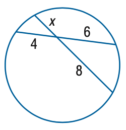
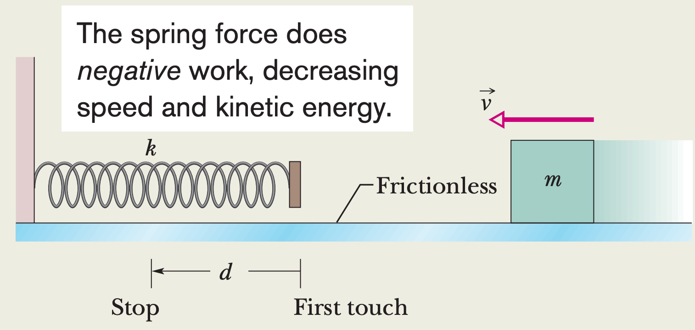

# Multimodal Task Integration Guide 📸

LLMRouter supports advanced multimodal reasoning by integrating Vision-Language Models (VLMs) into the data generation pipeline. This guide explains the currently supported tasks and how the pipeline processes visual information.

## Supported Multimodal Datasets

We currently support **5 multimodal tasks** across **3 diverse datasets**:

### 1. Geometry3K ( Geometry Problem Solving)

  

*   **Task**: Find x.
*   **VLM Description**: "Here's a description of the geometry diagram:
    *   **Shape:** A circle.
    *   **Chords:** Two intersecting chords are drawn within the circle.
    *   **Segment Lengths:** One chord is divided into segments of length 4 and 6. The other chord is divided into segments of length *x* and 8.
    *   **Label:** The variable *x* is labeled on one of the chord segments.
    *   **Relationships:** The chords intersect inside the circle." 

### 2. MathVista (Visual Math Reasoning)

  

*   **Task**: When a spring does work on an object, we cannot find the work by simply multiplying the spring force by the object's displacement. The reason is that there is no one value for the force-it changes. However, we can split the displacement up into an infinite number of tiny parts and then approximate the force in each as being constant. Integration sums the work done in all those parts. Here we use the generic result of the integration.

In Figure, a cumin canister of mass $m=0.40 \mathrm{~kg}$ slides across a horizontal frictionless counter with speed $v=0.50 \mathrm{~m} / \mathrm{s}$. It then runs into and compresses a spring of spring constant $k=750 \mathrm{~N} / \mathrm{m}$. When the canister is momentarily stopped by the spring, by what distance $d$ is the spring compressed?
*   **VLM Description**: "Here's a description of the image:
    *   **Overall Scene:** A horizontal surface with a spring, a block, and labels indicating 'Stop' and 'First touch'.
    *   **Elements:** A coiled spring labeled 'k' is compressed. A rectangular block labeled 'm' is positioned to the right. A horizontal arrow labeled 'v' points to the left.
    *   **Text:** 'The spring force does negative work, decreasing speed and kinetic energy.' 'Frictionless' is written between the spring and the block.
    *   **Symbol:** 'd' with an arrow indicating distance between the 'Stop' label and the start of the spring."

### 3. Charades-Ego (Video Understanding)

> 💡 **Deep Dive**: For a complete breakdown of our Video/VLM pipeline, seeing the [Charades-Ego Integration Guide](../charades_ego/README.md).

*   **Activity Recognition**: Identifying high-level activities (e.g., "Cooking").
*   **Object Recognition**: Identifying objects interacted with.
*   **Verb Recognition**: Identifying action verbs.

## Implementation Pipeline

The multimodal data generation follows a streamlined process found in `llmrouter/data/multimodal_generation.py`:

1.  **Image Extraction**: Raw images or video frames are extracted from the source dataset.
2.  **Preprocessing**: Images are converted to base64 format for API compatibility.
3.  **VLM Description**: A Vision-Language Model (e.g., GPT-4o, Gemini, or open weights like Qwen2-VL) processes the images in parallel batches.
4.  **Query Augmentation**: The VLM's output (description of the visual scene) is appended to the original text query.
5.  **Router Training**: This augmented text-only query is then used to train the router, allowing it to "see" the image content through the description.
