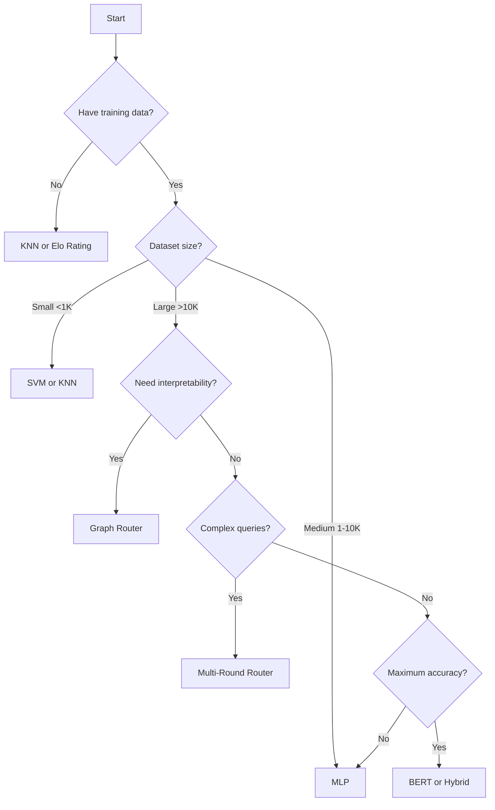

# Router Models

LLMRouter provides 15+ routing strategies, each designed for different use cases and performance characteristics.

## Router Categories

<div class="grid cards" markdown>

-   :brain:{ .lg .middle } __ML-Based Routers__

    ---

    Classic machine learning approaches

    KNN, SVM, MLP, Matrix Factorization

-   :material-graph:{ .lg .middle } __Graph-Based Routers__

    ---

    Relationship-aware routing

    GraphRouter, Elo Rating

-   :robot:{ .lg .middle } __Neural Routers__

    ---

    Deep learning models

    BERT Router, Causal LM, Hybrid LLM

-   :material-refresh:{ .lg .middle } __Multi-Round Routers__

    ---

    Complex query decomposition

    KNN Multi-Round, LLM Multi-Round

-   :material-axis-arrow:{ .lg .middle } __Baseline Routers__

    ---

    Simple strategies for comparison

    Smallest LLM, Largest LLM, Random

</div>

---

## ML-Based Routers

### KNN Router

**K-Nearest Neighbors** - Routes based on similarity to known query-model pairs.

```yaml
router_params:
  k: 5                      # Number of neighbors
  distance_metric: 'cosine' # Similarity metric
  weights: 'uniform'        # Voting strategy
```

**How it works:**
1. Embed the query using Longformer
2. Find K most similar queries in training data
3. Vote among their assigned LLMs
4. Select the most voted LLM

**Use Cases:**
- ✅ Quick prototyping
- ✅ Interpretable routing decisions
- ✅ Works with small training datasets
- ❌ Scales linearly with training data size

**Performance:**
- Training time: None (instance-based)
- Inference time: ~50ms
- Accuracy: 70-80% on ChatBot Arena

---

### SVM Router

**Support Vector Machine** - Learns decision boundaries between LLMs.

```yaml
router_params:
  kernel: 'rbf'             # Kernel function
  C: 1.0                    # Regularization
  gamma: 'scale'            # Kernel coefficient
```

**How it works:**
1. Embed queries into feature space
2. Learn hyperplanes separating different LLM choices
3. Classify new queries based on decision boundaries

**Use Cases:**
- ✅ High-dimensional feature spaces
- ✅ Clear separation between model choices
- ✅ Good generalization with small data
- ❌ Slower training with large datasets

**Performance:**
- Training time: ~5 minutes (10K samples)
- Inference time: ~30ms
- Accuracy: 72-82% on ChatBot Arena

---

### MLP Router

**Multi-Layer Perceptron** - Neural network for routing decisions.

```yaml
router_params:
  hidden_sizes: [256, 128, 64]
  activation: 'relu'
  dropout: 0.2
```

**How it works:**
1. Feed query embeddings through neural network
2. Learn complex non-linear patterns
3. Output probability distribution over LLMs

**Use Cases:**
- ✅ Large training datasets
- ✅ Complex routing patterns
- ✅ High accuracy requirements
- ❌ Requires more training data
- ❌ Less interpretable

**Performance:**
- Training time: ~15 minutes (10K samples, GPU)
- Inference time: ~20ms
- Accuracy: 75-85% on ChatBot Arena

---

### Matrix Factorization Router

**Collaborative Filtering** - Models query-LLM interactions as a matrix.

```yaml
router_params:
  embedding_dim: 64
  num_factors: 32
  regularization: 0.01
```

**How it works:**
1. Represent queries and LLMs as latent vectors
2. Learn embeddings that predict best matches
3. Compute similarity scores for routing

**Use Cases:**
- ✅ Large-scale routing data
- ✅ Capturing subtle patterns
- ✅ Cold-start handling
- ❌ Requires substantial training data

**Performance:**
- Training time: ~20 minutes (10K samples, GPU)
- Inference time: ~25ms
- Accuracy: 73-83% on ChatBot Arena

---

## Graph-Based Routers

### Graph Router

**Graph Neural Network** - Models relationships between queries and LLMs.

```yaml
router_params:
  num_layers: 3
  hidden_dim: 128
  num_heads: 4
  dropout: 0.1
```

**How it works:**
1. Build graph: queries and LLMs as nodes
2. Add edges based on historical routing
3. Use GNN to propagate information
4. Classify query nodes to LLM nodes

**Use Cases:**
- ✅ Rich relational data
- ✅ Capturing query similarities
- ✅ Transfer learning across domains
- ❌ Requires torch-geometric
- ❌ More complex setup

**Performance:**
- Training time: ~30 minutes (10K samples, GPU)
- Inference time: ~40ms
- Accuracy: 76-86% on ChatBot Arena

---

### Elo Rating Router

**Chess-style Rating** - Ranks LLMs based on pairwise comparisons.

```yaml
router_params:
  k_factor: 32              # Rating sensitivity
  initial_rating: 1500      # Starting Elo
  update_strategy: 'online' # Rating updates
```

**How it works:**
1. Maintain Elo ratings for each LLM
2. Update ratings based on query outcomes
3. Route to highest-rated LLM for query type
4. Continuously adapt ratings

**Use Cases:**
- ✅ Online learning scenarios
- ✅ A/B testing environments
- ✅ Adapting to model changes
- ❌ Requires continuous feedback

**Performance:**
- Training time: Online (incremental)
- Inference time: ~15ms
- Accuracy: 68-78% (improves over time)

---

## Neural Routers

### BERT Router

**BERT-based Classification** - Uses BERT for semantic understanding.

```yaml
router_params:
  model_name: 'bert-base-uncased'
  max_length: 512
  num_labels: 10
```

**How it works:**
1. Fine-tune BERT on routing task
2. Use [CLS] token for classification
3. Output LLM selection

**Use Cases:**
- ✅ Semantic similarity critical
- ✅ Complex query understanding
- ✅ Transfer learning from NLP tasks
- ❌ Slower inference
- ❌ Larger memory footprint

**Performance:**
- Training time: ~60 minutes (10K samples, GPU)
- Inference time: ~100ms
- Accuracy: 78-88% on ChatBot Arena

---

### Causal LM Router

**Language Model Routing** - Uses causal LM (GPT-style) for routing.

```yaml
router_params:
  model_name: 'gpt2'
  max_length: 512
  num_labels: 10
```

**How it works:**
1. Fine-tune causal LM on routing examples
2. Generate routing decision as text
3. Parse and execute routing

**Use Cases:**
- ✅ Few-shot learning
- ✅ Explainable routing decisions
- ✅ Instruction-based routing
- ❌ Slower than discriminative models

**Performance:**
- Training time: ~45 minutes (10K samples, GPU)
- Inference time: ~80ms
- Accuracy: 75-85% on ChatBot Arena

---

### Hybrid LLM Router

**Meta-Router** - Combines multiple routing strategies.

```yaml
router_params:
  base_routers: ['knnrouter', 'mlprouter', 'bertrouter']
  aggregation: 'voting'     # 'voting' or 'weighted'
  weights: [0.3, 0.4, 0.3]  # Router weights
```

**How it works:**
1. Run multiple routers in parallel
2. Aggregate predictions (voting or weighted)
3. Select final LLM

**Use Cases:**
- ✅ Maximum accuracy
- ✅ Robust to individual router failures
- ✅ Confidence estimation
- ❌ Slower (runs multiple routers)
- ❌ More complex

**Performance:**
- Training time: Sum of base routers
- Inference time: ~150ms (parallel) / ~200ms (sequential)
- Accuracy: 80-90% on ChatBot Arena

---

## Multi-Round Routers

### KNN Multi-Round Router

**Iterative KNN** - Routes complex queries through multiple steps.

```yaml
router_params:
  max_rounds: 3
  k: 5
  decomposition_strategy: 'rule-based'
```

**How it works:**
1. Decompose complex query into sub-queries
2. Route each sub-query with KNN
3. Aggregate results

**Use Cases:**
- ✅ Complex multi-part queries
- ✅ Query decomposition needed
- ✅ Cost optimization per sub-task
- ❌ Slower due to multiple rounds

**Performance:**
- Training time: None (instance-based)
- Inference time: ~150ms (3 rounds)
- Accuracy: 72-82% on complex queries

---

### LLM Multi-Round Router

**LLM-Guided Decomposition** - Uses LLM to decompose queries.

```yaml
router_params:
  max_rounds: 3
  decomposition_llm: 'gpt-3.5-turbo'
  base_router: 'knnrouter'
```

**How it works:**
1. Use LLM to decompose query
2. Route each sub-query
3. LLM aggregates results

**Use Cases:**
- ✅ Complex reasoning tasks
- ✅ High-quality decomposition
- ✅ Flexible routing strategies
- ❌ Requires LLM API for decomposition
- ❌ Higher cost

**Performance:**
- Training time: Depends on base router
- Inference time: ~2000ms (includes LLM calls)
- Accuracy: 78-88% on complex queries

---

## Baseline Routers

### Random Router

**Random Selection** - Randomly picks an LLM.

```yaml
router_params:
  seed: 42  # Optional for reproducibility
```

**Use Cases:**
- ✅ Baseline for comparison
- ✅ A/B testing
- ✅ Load balancing
- ❌ No optimization

**Performance:**
- Inference time: ~5ms
- Accuracy: ~33% (3 models), ~20% (5 models)

---

### Smallest LLM Router

**Always Cheapest** - Always routes to smallest/cheapest model.

```yaml
router_params:
  selection_criteria: 'cost'  # or 'parameters'
```

**Use Cases:**
- ✅ Cost minimization baseline
- ✅ Fast inference baseline
- ❌ May sacrifice quality

**Performance:**
- Inference time: ~5ms
- Cost: Minimum possible
- Accuracy: Depends on task complexity

---

### Largest LLM Router

**Always Best** - Always routes to largest/most capable model.

```yaml
router_params:
  selection_criteria: 'capability'  # or 'parameters'
```

**Use Cases:**
- ✅ Quality maximization baseline
- ✅ Upper bound performance
- ❌ Maximum cost

**Performance:**
- Inference time: ~5ms
- Quality: Maximum possible
- Cost: Maximum

---

## Router Comparison

| Router | Training Required | Inference Speed | Accuracy | Best For |
|--------|:----------------:|:---------------:|:--------:|----------|
| **KNN** | ❌ | ⚡⚡⚡ | ⭐⭐⭐ | Quick prototyping |
| **SVM** | ✅ | ⚡⚡⚡ | ⭐⭐⭐ | Small datasets |
| **MLP** | ✅ | ⚡⚡⚡⚡ | ⭐⭐⭐⭐ | General purpose |
| **Matrix Factorization** | ✅ | ⚡⚡⚡ | ⭐⭐⭐ | Large-scale data |
| **Graph** | ✅ | ⚡⚡ | ⭐⭐⭐⭐ | Relational data |
| **Elo Rating** | 🔄 | ⚡⚡⚡⚡ | ⭐⭐⭐ | Online learning |
| **BERT** | ✅ | ⚡⚡ | ⭐⭐⭐⭐⭐ | Semantic tasks |
| **Causal LM** | ✅ | ⚡⚡ | ⭐⭐⭐⭐ | Few-shot scenarios |
| **Hybrid** | ✅ | ⚡ | ⭐⭐⭐⭐⭐ | Maximum accuracy |
| **KNN Multi-Round** | ❌ | ⚡⚡ | ⭐⭐⭐⭐ | Complex queries |
| **LLM Multi-Round** | ✅ | ⚡ | ⭐⭐⭐⭐ | Complex reasoning |

---

## Choosing the Right Router



---

## Training Your Router

See the [Training Guide](training.md) for detailed instructions on training each router type.

**Quick Training:**
```bash
llmrouter train \
  --router mlprouter \
  --config configs/model_config_train/mlprouter.yaml \
  --device cuda
```

---

## Next Steps

<div class="grid cards" markdown>

-   :material-school:{ .lg .middle } __Training Tutorial__

    ---

    Step-by-step guide to train routers

    [:octicons-arrow-right-24: Training Guide](training.md)

-   :wrench:{ .lg .middle } __Custom Routers__

    ---

    Build your own router

    [:octicons-arrow-right-24: Custom Router Guide](../custom-routers/quick-guide.md)

-   :material-test-tube:{ .lg .middle } __Tutorials__

    ---

    Interactive Colab notebooks

    [:octicons-arrow-right-24: Browse Tutorials](../tutorials/index.md)

</div>
