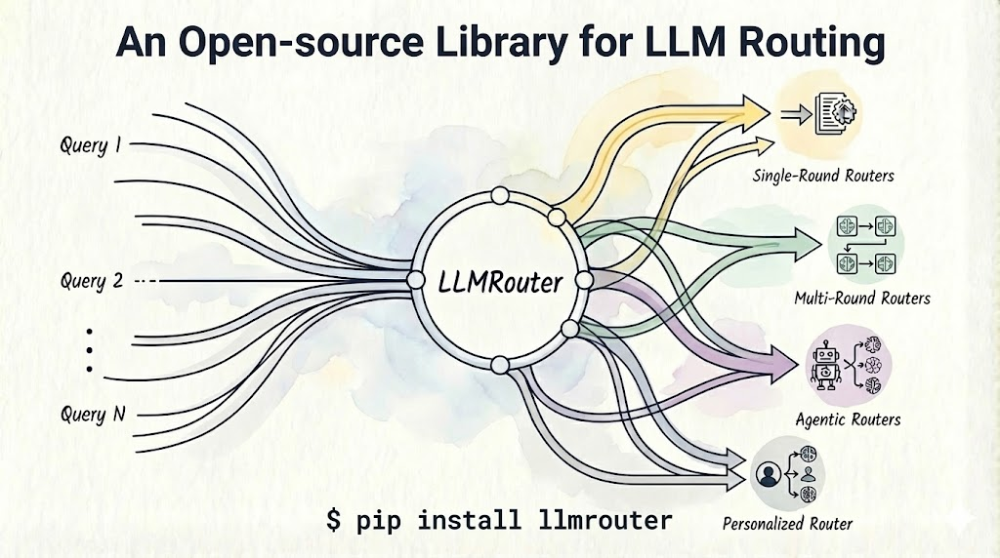
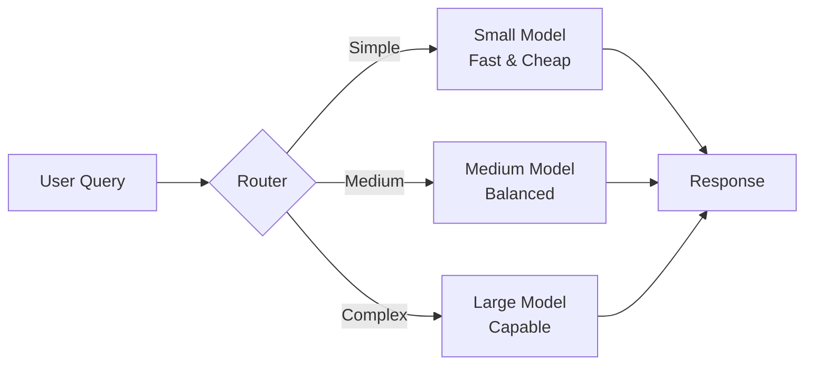

# Welcome to LLMRouter

<div align="center">
  

  [](https://www.python.org/downloads/release/python-3109/)
  [](https://github.com/ulab-uiuc/LLMRouter/pulls)
  [](https://join.slack.com/t/llmrouteropen-ri04588/shared_invite/zt-3jz3cc6d1-ncwKEHvvWe0OczHx7K5c0g)
  [](LICENSE)
</div>

## What is LLMRouter?

**LLMRouter** is an intelligent routing system designed to optimize LLM inference by **dynamically selecting the most suitable model** for each query based on task complexity, cost, and performance requirements.

### Key Features

<div class="grid cards" markdown>

-   :rocket:{ .lg .middle } __Smart Routing__

    ---

    Automatically routes queries to the optimal LLM based on task complexity, cost, and performance requirements.

-   :bar_chart:{ .lg .middle } __15+ Router Models__

    ---

    Support for KNN, SVM, MLP, Matrix Factorization, Elo Rating, Graph-based, BERT-based, and many more advanced routing strategies.

-   :wrench:{ .lg .middle } __Unified CLI__

    ---

    Complete command-line interface for training, inference, and interactive chat with Gradio-based UI.

-   :package:{ .lg .middle } __Plugin System__

    ---

    Easily add custom routers without modifying the core codebase. Full documentation and examples provided.

</div>

## Quick Start

=== "Installation"

    ```bash
    # Clone the repository
    git clone https://github.com/ulab-uiuc/LLMRouter.git
    cd LLMRouter

    # Create virtual environment
    conda create -n llmrouter python=3.10
    conda activate llmrouter

    # Install
    pip install -e .
    ```

=== "First Inference"

    ```bash
    # Run inference with a router
    llmrouter infer \
      --router knnrouter \
      --config configs/model_config_test/knnrouter.yaml \
      --query "What is machine learning?"
    ```

=== "Train a Router"

    ```bash
    # Train your own router
    llmrouter train \
      --router mlprouter \
      --config configs/model_config_train/mlprouter.yaml \
      --device cuda
    ```

=== "Interactive Chat"

    ```bash
    # Launch Gradio chat interface
    llmrouter chat \
      --router knnrouter \
      --config config.yaml
    ```

## Why LLMRouter?

### The Problem

Modern applications have access to dozens of LLMs, each with different strengths:
- **GPT-4**: Excellent reasoning, expensive
- **Claude**: Strong analysis, high cost
- **Llama-3-70B**: Good performance, moderate cost
- **Mistral-7B**: Fast, cheap, limited capability

**Challenge**: How do you choose the right model for each query automatically?

### The Solution

LLMRouter intelligently routes queries to the optimal model:



**Benefits:**
- :material-currency-usd: **Cost Optimization**: Save up to 80% on inference costs
- :material-speedometer: **Performance**: Faster responses for simple queries
- :material-check-circle: **Quality**: Better results by matching task complexity to model capability
- :material-lightning-bolt: **Flexibility**: Easy to add new models and routing strategies

## Supported Routers

LLMRouter provides 15+ routing strategies:

| Category | Routers | Training | Use Case |
|----------|---------|:--------:|----------|
| **ML-Based** | KNN, SVM, MLP, Matrix Factorization | ✅ | General-purpose routing |
| **Graph-Based** | GraphRouter, Elo Rating | ✅ | Relationship-aware routing |
| **Neural** | BERT Router, Causal LM | ✅ | Semantic understanding |
| **Multi-Round** | KNN Multi-Round, LLM Multi-Round | ✅ | Complex query decomposition |
| **Baselines** | Smallest LLM, Largest LLM, Random | ❌ | Comparison & testing |

[See all routers →](features/routers.md){ .md-button }

## Interactive Tutorials

All tutorials are available as **Google Colab notebooks** - no setup required!

<div class="grid cards" markdown>

-   :beginner:{ .lg .middle } __Beginner__

    ---

    - [Quick Start](tutorials/00-quick-start.md) - Your first inference in 5 minutes
    - [Installation & Setup](tutorials/01-installation-setup.md) - Detailed setup guide
    - [Data Preparation](tutorials/02-data-preparation.md) - Understanding data formats

    [:octicons-arrow-right-24: Start Learning](tutorials/index.md)

-   :rocket:{ .lg .middle } __Intermediate__

    ---

    - [Training Routers](tutorials/03-training-routers.md) - Train your first router
    - [Inference & Evaluation](tutorials/05-inference-evaluation.md) - Evaluate performance
    - [Interactive Chat](tutorials/06-interactive-chat.md) - Launch chat interface

    [:octicons-arrow-right-24: Level Up](tutorials/index.md)

-   :star:{ .lg .middle } __Advanced__

    ---

    - [Custom Routers](tutorials/07-custom-routers.md) - Build your own router
    - [Adding New Models](tutorials/09-adding-models.md) - Expand model pool
    - [Custom Datasets](tutorials/10-custom-datasets.md) - Use your own data

    [:octicons-arrow-right-24: Master LLMRouter](tutorials/index.md)

</div>

## Community & Support

<div class="grid cards" markdown>

-   :fontawesome-brands-github:{ .lg .middle } __GitHub__

    ---

    Star the repo, report issues, contribute code

    [:octicons-arrow-right-24: GitHub Repo](https://github.com/ulab-uiuc/LLMRouter)

-   :fontawesome-brands-slack:{ .lg .middle } __Slack__

    ---

    Join our community for discussions and support

    [:octicons-arrow-right-24: Join Slack](https://join.slack.com/t/llmrouteropen-ri04588/shared_invite/zt-3jz3cc6d1-ncwKEHvvWe0OczHx7K5c0g)

-   :material-file-document:{ .lg .middle } __Documentation__

    ---

    Comprehensive guides, API reference, and examples

    [:octicons-arrow-right-24: Read Docs](getting-started/installation.md)

-   :material-school:{ .lg .middle } __Tutorials__

    ---

    Step-by-step Colab notebooks for all skill levels

    [:octicons-arrow-right-24: Start Learning](tutorials/index.md)

</div>

## Research & Citation

If you use LLMRouter in your research, please cite:

```bibtex
@software{llmrouter2024,
  title={LLMRouter: An Open-Source Library for LLM Routing},
  author={ULAB UIUC},
  year={2024},
  url={https://github.com/ulab-uiuc/LLMRouter}
}
```

## Star History

[](https://star-history.com/#ulab-uiuc/LLMRouter&Date)

## License

LLMRouter is released under the [MIT License](https://github.com/ulab-uiuc/LLMRouter/blob/main/LICENSE).
