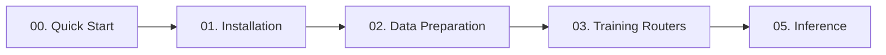
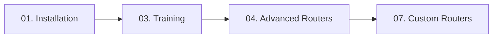
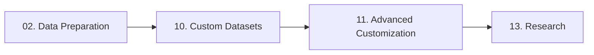
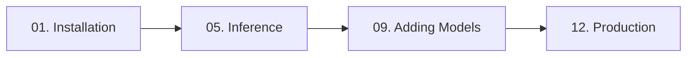

# Tutorials

Welcome to the LLMRouter tutorial collection! These interactive Google Colab notebooks will guide you through everything from basic usage to advanced customization.

!!! tip "Zero Setup Required"
    All tutorials run directly in Google Colab with free GPU access. No local installation needed!

## Tutorial Structure

Our tutorials are organized by skill level. Each tutorial is a complete, runnable Colab notebook with:

- ✅ Clear learning objectives
- ✅ Step-by-step instructions
- ✅ Runnable code cells with expected outputs
- ✅ Common errors and solutions
- ✅ Practice exercises
- ✅ Links to next steps

---

## :beginner: Beginner Level

Perfect for getting started with LLMRouter.

### 00. Quick Start
**Estimated Time:** 15 minutes | **Prerequisites:** None

Learn the basics of LLMRouter and run your first inference in minutes.

**What You'll Learn:**

- Install LLMRouter in Colab
- Understand routing concepts
- Run inference with built-in routers
- Explore different router types

[:fontawesome-brands-python: Open in Colab](https://colab.research.google.com/github/ulab-uiuc/LLMRouter/blob/main/tutorials/notebooks/00_Quick_Start.ipynb){ .md-button .md-button--primary }
[:octicons-book-16: Read Tutorial](00-quick-start.md){ .md-button }

---

### 01. Installation and Setup
**Estimated Time:** 20 minutes | **Prerequisites:** None

Detailed guide to installing and configuring LLMRouter.

**What You'll Learn:**

- Environment setup and dependencies
- API key configuration
- Verify installation
- Troubleshoot common issues

[:fontawesome-brands-python: Open in Colab](#){ .md-button .md-button--primary }
[:octicons-book-16: Read Tutorial](01-installation-setup.md){ .md-button }

---

### 02. Data Preparation
**Estimated Time:** 30 minutes | **Prerequisites:** Tutorial 01

Understand the data formats used by LLMRouter.

**What You'll Learn:**

- LLM candidates JSON format
- Query data (JSONL) structure
- Routing ground truth format
- Data preprocessing techniques
- Loading and validating datasets

[:fontawesome-brands-python: Open in Colab](#){ .md-button .md-button--primary }
[:octicons-book-16: Read Tutorial](02-data-preparation.md){ .md-button }

---

## :rocket: Intermediate Level

Dive deeper into training and evaluation.

### 03. Training Single-Round Routers
**Estimated Time:** 45 minutes | **Prerequisites:** Tutorials 01, 02

Train your first routers using classic ML approaches.

**What You'll Learn:**

- Train KNN Router
- Train SVM Router
- Train MLP Router
- Train Matrix Factorization Router
- Compare router performance

[:fontawesome-brands-python: Open in Colab](#){ .md-button .md-button--primary }
[:octicons-book-16: Read Tutorial](03-training-routers.md){ .md-button }

---

### 04. Training Advanced Routers
**Estimated Time:** 45 minutes | **Prerequisites:** Tutorial 03

Explore advanced neural and graph-based routing strategies.

**What You'll Learn:**

- Train Graph Router
- Train Dual Contrastive Router
- Train Causal LM Router
- Train Hybrid LLM Router
- Compare with baseline routers

[:fontawesome-brands-python: Open in Colab](#){ .md-button .md-button--primary }
[:octicons-book-16: Read Tutorial](04-advanced-routers.md){ .md-button }

---

### 05. Inference and Evaluation
**Estimated Time:** 30 minutes | **Prerequisites:** Tutorial 03

Run inference and evaluate router performance.

**What You'll Learn:**

- Single query inference
- Batch inference
- Route-only mode (no API calls)
- Performance metrics (accuracy, F1)
- Cost analysis and optimization

[:fontawesome-brands-python: Open in Colab](#){ .md-button .md-button--primary }
[:octicons-book-16: Read Tutorial](05-inference-evaluation.md){ .md-button }

---

### 06. Interactive Chat Interface
**Estimated Time:** 20 minutes | **Prerequisites:** Tutorial 05

Launch a Gradio-based chat interface for interactive routing.

**What You'll Learn:**

- Launch Gradio chat UI
- Query modes (current_only, full_context, retrieval)
- Customize chat interface
- Deploy chat interface

[:fontawesome-brands-python: Open in Colab](#){ .md-button .md-button--primary }
[:octicons-book-16: Read Tutorial](06-interactive-chat.md){ .md-button }

---

## :star: Advanced Level

Master custom routers and advanced features.

### 07. Creating Custom Routers
**Estimated Time:** 60 minutes | **Prerequisites:** Tutorial 03

Build your own custom routing strategies.

**What You'll Learn:**

- Understand MetaRouter interface
- Build a simple rule-based router
- Add training support with Trainer class
- Test custom routers
- Use the plugin system

[:fontawesome-brands-python: Open in Colab](#){ .md-button .md-button--primary }
[:octicons-book-16: Read Tutorial](07-custom-routers.md){ .md-button }

---

### 08. Multi-Round Routers
**Estimated Time:** 45 minutes | **Prerequisites:** Tutorial 05

Implement complex multi-round routing for query decomposition.

**What You'll Learn:**

- Understand multi-round routing
- Train KNN Multi-Round Router
- Train LLM Multi-Round Router
- Complex query decomposition strategies

[:fontawesome-brands-python: Open in Colab](#){ .md-button .md-button--primary }
[:octicons-book-16: Read Tutorial](08-multi-round.md){ .md-button }

---

### 09. Adding New LLM Models
**Estimated Time:** 30 minutes | **Prerequisites:** Tutorial 02

Expand your model pool with new LLM models.

**What You'll Learn:**

- LLM candidates JSON structure
- Add model configurations
- Generate model embeddings
- API integration (OpenAI, Anthropic, etc.)
- Test new models in routing

[:fontawesome-brands-python: Open in Colab](https://colab.research.google.com/github/ulab-uiuc/LLMRouter/blob/main/tutorials/notebooks/09_Adding_New_LLM_Models.ipynb){ .md-button .md-button--primary }
[:octicons-book-16: Read Tutorial](09-adding-models.md){ .md-button }

---

### 10. Creating Custom Datasets
**Estimated Time:** 45 minutes | **Prerequisites:** Tutorial 02

Use your own data for training routers.

**What You'll Learn:**

- Dataset format requirements
- Convert existing datasets
- ChatBot Arena format
- MT-Bench format
- Custom domain data preparation
- Data validation techniques

[:fontawesome-brands-python: Open in Colab](https://colab.research.google.com/github/ulab-uiuc/LLMRouter/blob/main/tutorials/notebooks/10_Creating_Custom_Datasets.ipynb){ .md-button .md-button--primary }
[:octicons-book-16: Read Tutorial](10-custom-datasets.md){ .md-button }

---

### 11. Advanced Customization
**Estimated Time:** 45 minutes | **Prerequisites:** Tutorials 07, 09

Advanced techniques for customizing LLMRouter.

**What You'll Learn:**

- Custom embedding models
- Custom evaluation metrics
- Cost-aware routing strategies
- Latency optimization
- A/B testing routers

[:fontawesome-brands-python: Open in Colab](#){ .md-button .md-button--primary }
[:octicons-book-16: Read Tutorial](11-advanced-customization.md){ .md-button }

---

## :mortar_board: Expert Level

Production deployment and research applications.

### 12. Production Deployment
**Estimated Time:** 30 minutes | **Prerequisites:** Tutorial 05

Deploy LLMRouter in production environments.

**What You'll Learn:**

- API deployment strategies
- Scaling considerations
- Monitoring and logging
- Error handling
- Performance optimization
- Best practices

[:fontawesome-brands-python: Open in Colab](#){ .md-button .md-button--primary }
[:octicons-book-16: Read Tutorial](12-production.md){ .md-button }

---

### 13. Research and Experimentation
**Estimated Time:** 45 minutes | **Prerequisites:** All previous tutorials

Conduct research with LLMRouter.

**What You'll Learn:**

- Benchmarking router strategies
- Ablation studies
- Novel routing approaches
- Statistical analysis
- Publishing results

[:fontawesome-brands-python: Open in Colab](#){ .md-button .md-button--primary }
[:octicons-book-16: Read Tutorial](13-research.md){ .md-button }

---

## :compass: Learning Paths

Choose a path based on your goals:

### For Complete Beginners

**Recommended:** 00 → 01 → 02 → 03 → 05

### For ML Practitioners

**Recommended:** 01 → 03 → 04 → 07

### For Researchers

**Recommended:** 02 → 10 → 11 → 13

### For Production Use

**Recommended:** 01 → 05 → 09 → 12

---

## :bulb: Tips for Using These Tutorials

-   :material-order-numeric-ascending:{ .lg .middle } __Follow the Order__

    ---

    Tutorials build on each other. Follow the recommended sequence for the best learning experience.

-   :material-flask:{ .lg .middle } __Experiment__

    ---

    Modify code cells to understand behavior. Try different parameters and see what happens!

-   :material-content-save:{ .lg .middle } __Save Your Work__

    ---

    Click "Copy to Drive" in Colab to save your own version before making changes.

-   :material-gpu:{ .lg .middle } __Use GPU__

    ---

    Enable GPU runtime in Colab (Runtime → Change runtime type → GPU) for training tutorials.

---

## :package: Downloading Tutorial Data

All tutorials use example data from the repository:

- `data/example_data/` - Small datasets for quick testing
- `data/chatbot_arena/` - Real-world ChatBot Arena data (optional)
- `data/mt_bench/` - MT-Bench evaluation data (optional)

The Colab notebooks automatically download required data.

---

## :question: Getting Help

Having trouble with a tutorial?

-   :fontawesome-brands-github:{ .lg .middle } __GitHub Issues__

    ---

    Report bugs or ask questions

    [:octicons-arrow-right-24: Create Issue](https://github.com/ulab-uiuc/LLMRouter/issues)

-   :fontawesome-brands-slack:{ .lg .middle } __Slack Community__

    ---

    Get help from the community

    [:octicons-arrow-right-24: Join Slack](https://join.slack.com/t/llmrouteropen-ri04588/shared_invite/zt-3jz3cc6d1-ncwKEHvvWe0OczHx7K5c0g)

-   :material-file-document:{ .lg .middle } __Documentation__

    ---

    Check the full documentation

    [:octicons-arrow-right-24: Read Docs](../index.md)

---

## :handshake: Contributing

Found an error or want to add a tutorial? We welcome contributions!

See our [Contributing Guide](../community/contributing.md) for details.

---

!!! success "Ready to Start?"
    Begin with [Tutorial 00: Quick Start](00-quick-start.md) and start your LLMRouter journey! :rocket:
